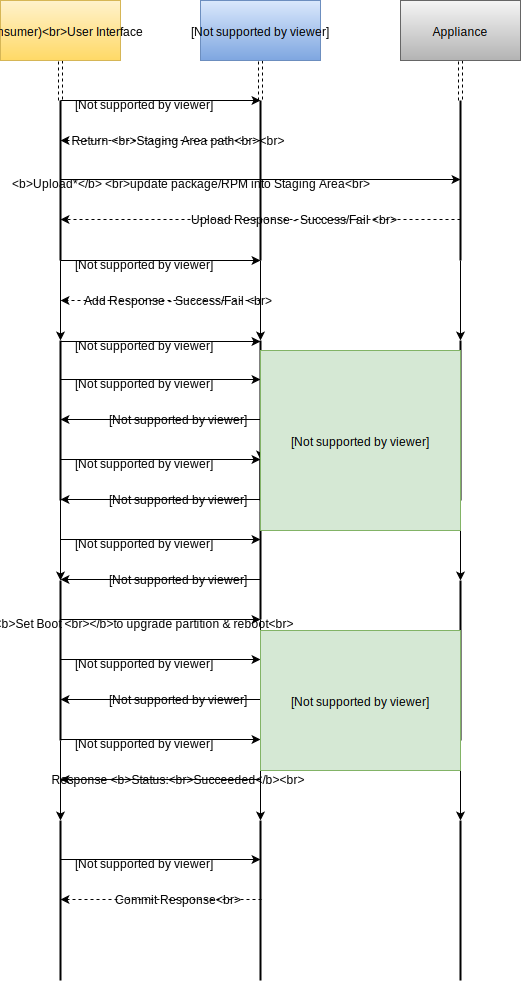

# Software Update Manager (SUM)

The Software Update Manager (SUM) provides ability to update a system. It could be used to perform major or minor updates. The main difference of major and minor updates is whether the update RPM contains the entire ISO contents or not. The SUM framework can be used to perform live update or an offline update (i.e., utilitizing a separate partition). It relies on [Plugin Manager](https://github.com/VeritasOS/plugin-manager) & Plugins to drive or replay any required configuration. The SUM architecture & workflow can be found in the following sections.

> **Table of Contents**

<!-- TOC -->

- [Software Update Manager (SUM)](#software-update-manager-sum)
- [Architecture](#architecture)
- [Workflow](#workflow)
  - [Plugins](#plugins)
    - [Install](#install)
    - [Reboot](#reboot)
    - [Rollback](#rollback)
    - [Commit](#commit)
- [Generating Update RPM](#generating-update-rpm)
- [Sample Update](#sample-update)

<!-- /TOC -->

# Architecture

At a high-level, the SUM architecture is as shown below.

1. User/consumer gets the location of the [staging area](./staging_area.md), and uploads the [update package](./validate.md) into [staging area](./staging_area.md).
    > SUM doesn't provide an upload API. The update package must be uploaded into the [staging area](./staging_area.md) by the consuming application/product (using appropriate authentication).
1. Once the update package is in staging area, it must be first [added](./add.md) it into SUM software repository. [Adding](./add.md) it into SUM software repository also [validates](./validate) the update package for version compatibility with system. Once it's made available in SUM software repository, it could be [listed](./list.md), [installed](./install.md) and/or [deleted](./delete.md).
1. User/consumer can start the [installation](./install.md) and monitor it's [status](./status.md) to see if it's ready for reboot.
1. Once the system is ready for reboot, user/consumer can run prereboot operations like [set-boot](./set-boot.md) & reboot in to updated version immediately (or choose to do it later).
1. When user/consumer reboots to updated version, the update will proceed with any post-reboot update actions, and update the [status](./status.md) appropriately towards the end of the update operation.

> NOTE: SUM is designed to update system locally. The rolling updates in case of cluster, should be handled by the orchestration layer.

# Workflow

This section details out the design of the SUM Update Framework.

## Plugins

The SUM Framework uses [Plugin Manager (PM)](./pm.md) to perform several of it's actions, and defines the types of plugins to perform following user actions: install, reboot, rollback and commit in the below sections.
The framework also defines certain variables to enable plugins to access following paths:

| Environment Variable | Description |
| --- | --- |
| `${PM_LIBRARY}` | Plugins library path. |
| `${VXAPP_UPGRADE_ROOT}` | Alternate root volume path for doing offline updates. |

### Install

| Types | File extensions | Examples |
| --- | --- | --- |
| Pre-install update actions | `.preinstall` | - Bind mount required file systems inside update volume before installing RPM/ISO, to share configuration that could be used during install step. One could have say `mountfs.preinstall` plugin to perform the same action.   - Check whether application is stopped. |
| Install update actions | `.install` | VUF install could be used with appropriate arguments to perform either live or offline update. |

### Reboot

| Types | File extensions | Examples |
| --- | --- | --- |
| Pre-reboot config, replay or validations | `.prereboot` | Copy config or keys (say ssh-keys) from current root to upgrade volume
| Post-reboot config, replay or validations | `.postreboot` | Load any container images into docker registery. |

> **NOTE:** If an action can be performed before the reboot, then it is recommended to do it in the `.prereboot` plugin rather than a `.postreboot` plugin, so that if there are any failures, it can be caught before reboot which helps in avoiding downtime for customers.

### Rollback

| Types | File extensions | Examples |
| --- | --- | --- |
| Prechecks before starting rollback | `.rollback-precheck` | - Check whether node is updated.   - Check whether instances are stopped. |
| Pre rollback actions | `.prerollback` | - Set Grub to boot to old version in case of using offline update approach.   - Revert snapshot. |
| Rollback actions | `.rollback` | - Remove new version container images. |

### Commit

| Types | File extensions | Examples |
| --- | --- | --- |
| Precheck before starting commit | `.commit-precheck` | - To check if all nodes in the cluster are updated.   - Check for applications are stopped if cluster upgrade action requires them to be stopped. |
| Commit actions and cleanup any remnants | `.commit` | - Remove previous version container images.   - Perform one time actions that could not be run earlier in install step as they do not support rollback. Examples:   - cluster or storage (disk/fs) protocol upgrade. |

> NOTE: The rollback plugins are expected to be re-runnable. In case [rollback fails](./troubleshooting.md), rollback plugins could be executed through [Plugin Manager (PM)](https://github.com/VeritasOS/plugin-manager).

> - _For usage details of install, rollback and commit, refer to [install](./install.md), [rollback](./rollback.md) and [commit](./commit.md) documentation._

The update plugins must be deployed into a plugin folder under plugins library path i.e., `${PM_LIBRARY}/<plugin-folder>/`.
To access this path in plugins, one must use environment variable `${PM_LIBRARY}` to access the plugins library location.

# Generating Update RPM

An update RPM should be SUM format compliant in order for one to successfully
install the update. In order to generate such an RPM, one should use SUM SDK.
For more details about SDK, refer to [SUM SDK](./sdk/README.md).

# Sample Update

A example usage of the framework can be found here:
[sample-update](sample/update/Makefile).
