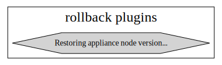

# Update plugins' and its dependencies

The document lists the plugins that are bundled into the update RPM using [ĀSUM SDK](../../sdk/README.md).

The update framework workflow details can be found in here: [ĀSUM update framework](../../README.md).

> NOTES

1. The plugins in red color indicates that it was mentioned in dependency, but the plugin itself is missing in the `${PM_LIBRARY}` location.
2. Apart from `.preinstall` plugins, all other plugins can be directly installed into `${PM_LIBRARY}` via component RPM install. So, plugins missing at build time may not be an issue.

## preinstall

## install

## prereboot

## postreboot

## rollback-precheck

## prerollback

## rollback

## commit-precheck

## commit

